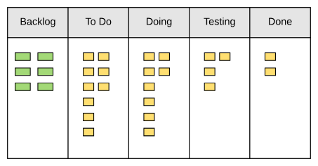
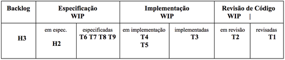

# 2.1 Importância de Processos

Um *software* deve passar por um processo claro e bem definido. Apesar dos pesares, para uso pessoal, esses processos não são estritamente necessários; já que os impactos das alterações não afetam outros trabalhos, mas apenas o seu próprio.

>Por meio deste trabalho, passamos a valorizar:
>Indivíduos e interações, mais do que processos e ferramentas
>Software em funcionamento, mais do que documentação abrangente
>Colaboração com o cliente, mais do que negociação de contratos
>Resposta a mudanças, mais do que seguir um plano.

Uma metodologia ágil indica um processo **cíclico** e, portanto, iterativo.

Principais características:

- Menor ênfase em documentação;
- Menor ênfase em planos detalhados;
- Inexistência de uma fase dedicada a design;
- Desenvolvimento em times pequenos.

Principais métodos ágeis:

- Extreme Programming;
- SCRUM;
- Kanban.

## Extreme Programming

**Recomendado** para desenvolver software com requisitos vagos ou sujeitos a mudanças. É interessante notar que o XP define apenas um conjunto de **valores, princípios e práticas de desenvolvimento**; são elas:

- Valores: comunicação, simplicidade, feedback, coragem, respeito e qualidade de vida.
- Princípios: humanidade, economicidade, benefícios mútuos, melhorias contínuas, falhas acontecem, baby steps e responsabilidade pessoal.
- Práticas sobre o Processo de Desenvolvimento: representante dos clientes, histórias dos usuários, iterações, releases, planejamento de releases, planejamento de iterações, planning poker, slack.
- Práticas de Programação: design incremental, programação pareada, desenvolvimento dirigido por testes (TDD), build automatizado, integração contínua.
- Práticas de Gerenciamento de Projetos: métricas, ambiente de trabalho, contratos com escopo aberto.

### Práticas de programação

- Design Incremental
- Programação em Pares

## Scrum

### Papéis

- Dono do produtos
- Scrum Master
- Colaboradores
  
### Artefatos e Eventos

- Backlog do produto
- Sprint
- Planejamento do Sprint
- Backlog do Sprint

## Kanban

Mais fácil do que scrum, já que não tem seus eventos (como *Sprint* etc). Segue:
