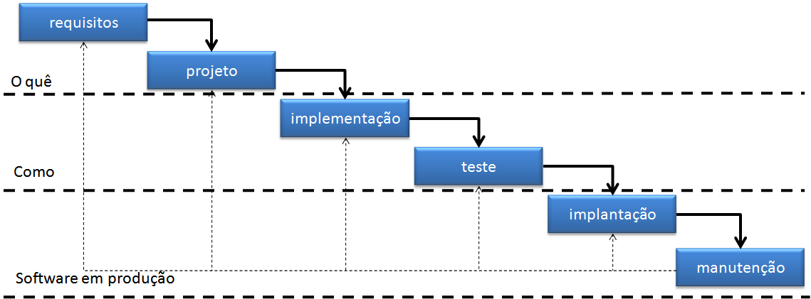
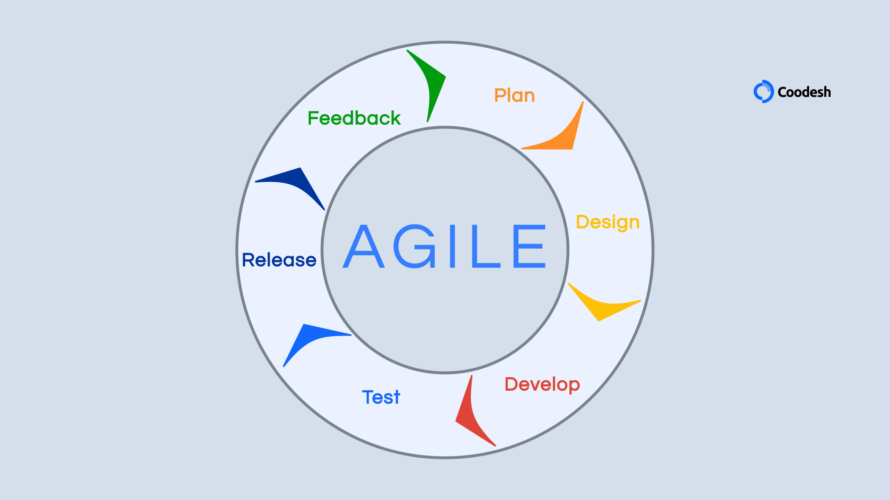

# Aula 07/04/2025

---

## Requisitos de software

Os requisitos podem ser divididos em 2:

Funcionais:

- "O que" um sistema deve fazer.
  
Não funcionais:

- "Como" um sistema deve operar:
  - Desempenho;
  - Disponibilidade;
  - Capacidade;
  - Tolerância a falhas;
  - Segurança.

### Testes de *Software*

Verificam se um programa apresenta um resultado esperado ao ser executado com casos de teste.

- Manuais;
- Automatizados.
  
Um teste é dividido em 2 partes:

- Verificação: Implementado corretamente?
- Validação: Satisfaz o que o cliente quer?

### Manutenção

- Corretiva
- Preventinva
- Adaptiva
- Evolutiva
- Refactoring

### Processos de desenvolvimento de software

- Quais atividade devem ser seguidas
- Principais modelos:
  - Waterfall
    
    - Requisitos mudam com frequência
    - Documentações verbosas
    - Rapidamente obsoletas
  - Ágil
    
